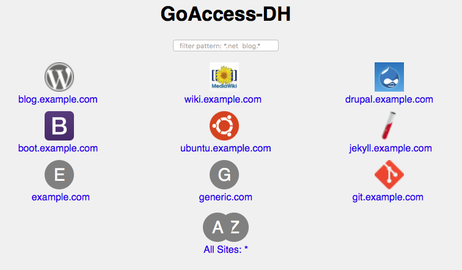

GoAccess for DreamHost
======================

An easy to setup packaging of [GoAccess](https://goaccess.io) for use on [DreamHost](https://www.dreamhost.com) web-hosting
services (shared servers and VPS).



Features:

- Automatically lists active web sites.
- Generate GoAccess reports based on current logs.
- Generate Reports for single or multiple sites.
- Entirely written in Bash CGI!

Notes:

- Reports use the avaiable raw logs, which DH default to 3 days. Sites can be configured to keep up to 30 days of raw logs in the [Site Statistics Panel](https://panel.dreamhost.com/index.cgi?tree=advanced.stats&).
- Reports are generated on the fly, so expect ~60 seconds of processing time per million requests.


Installation
------------

GoAccess-DH can be installed anywhere on a web site. It comes with a pre-built binary of GoAccess, or you can build it from scratch.

- **Quick Install**
  
  Download GoAccess-DH from:
  
  https://github.com/chuckhoupt/goaccess-dh/archive/master.zip

  Upload/Install in a web directory, such as `~/example.com/goaccess-dh/`.
  
  
- **Build from Source**

  If you'd prefer to build your own binary, log into a shell user and clone GoAccess-DH into `example.com`'s web directory:

  ```
  git clone --recurse-submodules https://github.com/chuckhoupt/goaccess-dh.git ~/example.com/goaccess-dh
  ```

   Run Make to configure and compile GoAccess:
   
   ```
   make -C ~/example.com/goaccess-dh
   ```

Now visit `example.com/goaccess-dh/` to see the stats for all sites hosted
under that shell user.

Further Configuration
---------------------

- **Secure Reports**

   Setup password protection for the `goaccess-dh` directory via
   [DH's Htaccess Panel](https://panel.dreamhost.com/index.cgi?tree=advanced.webdav&).
